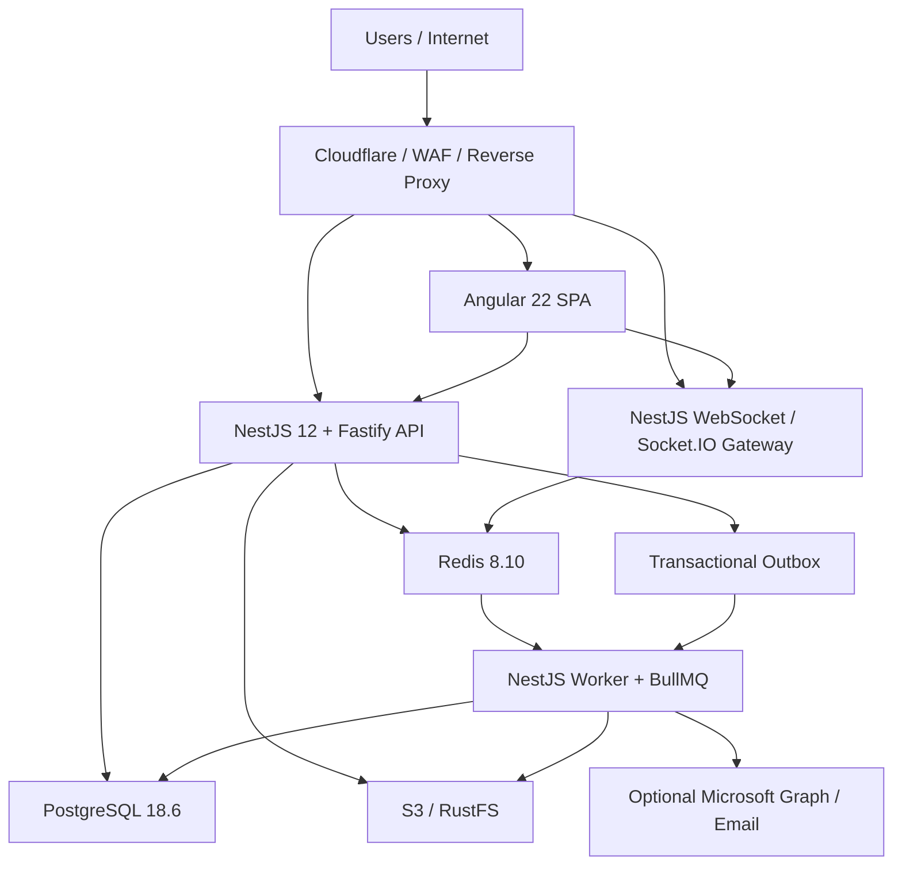
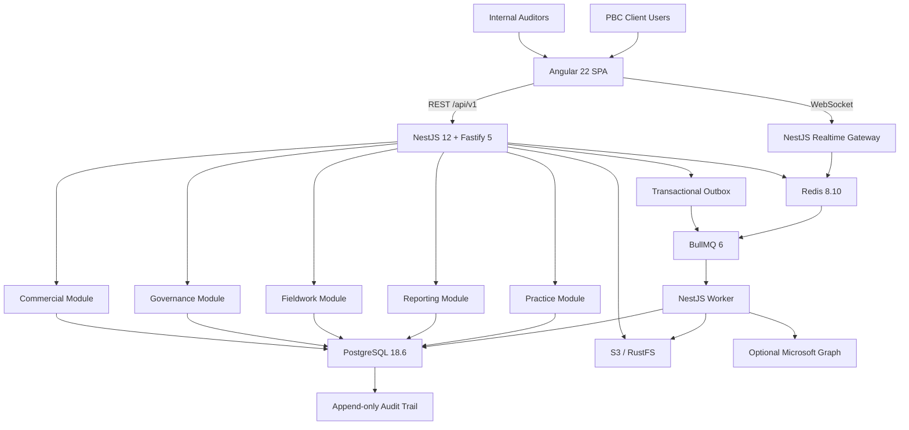

# AuditSphere / STE Audit Management Tool
## Production Architecture & AI-Agent-Friendly Implementation Plan
### NestJS + Fastify + Angular + PostgreSQL

**Architecture version:** 1.0  
**Requirements baseline:** `auditsphere-accounting-module-requirements-current.md`, Document Version 2.1 / `CURRENT`  
**Architecture decision date:** 2026-10-01  
**Target style:** Production modular monolith, TypeScript end-to-end, AI-agent-friendly, audit-traceable  
**Primary currency:** QAR  
**Functional baseline:** The attached requirements remain authoritative. Only the implementation technology and technical architecture are superseded by this plan.

---

# 1. Executive Decision

Build AuditSphere as a **TypeScript modular monolith** with three deployable applications from one monorepo:

1. **API** — NestJS + Fastify.
2. **Web** — Angular.
3. **Worker** — NestJS application context + BullMQ processors for imports, PDFs, notifications, archival operations, and other expensive/background work.

Use:

- **PostgreSQL** as the authoritative business system of record.
- **Redis** for ephemeral coordination only: queues, edit leases, cache where justified, Socket.IO scale-out, and short-lived distributed locks.
- **S3-compatible object storage** for document/evidence bytes. **RustFS** is the selected implementation, replacing the earlier MinIO assumption.
- **Microsoft Entra ID / Microsoft Graph adapters** as optional platform integrations without coupling business modules directly to Microsoft APIs.
- **REST + OpenAPI** for application APIs.
- **WebSockets** only for transient real-time collaboration/notifications; every reconnect reloads authoritative state from the API.

Do **not** start with microservices, GraphQL, event sourcing, Kafka, Kubernetes, or independent databases per module.

The central architecture rule is:

> **Business truth lives in PostgreSQL. Redis and WebSocket state are disposable. Files are immutable/versioned objects with PostgreSQL metadata.**

---

# 2. Verified Stable Technology Baseline

The following baseline was selected on **2026-10-01** using stable releases and compatibility constraints.

| Layer | Selected baseline | Decision |
|---|---|---|
| Runtime | **Node.js 24.21.x LTS** | Use the Node 24 LTS line across local development, CI, API and workers. |
| Backend framework | **NestJS 12.1.x** | Current stable Nest major; ESM-first, Standard Schema validation, native observability support. |
| HTTP adapter | **Fastify 5.12.x** | Current stable Fastify v5. |
| Frontend | **Angular 22.2.x** | Current stable Angular line. |
| Angular UI | **Angular Material/CDK 22.2.x** | Use CDK heavily for accessible data-heavy UI. |
| TypeScript | **6.0.x compatible line** | Pin to Angular 22's supported range. Do not upgrade to TS 7 until Angular officially supports it. |
| Runtime schema validation | **Zod 4.6.x** | Nest 12 Standard Schema compatible; single-schema runtime + compile-time contracts. |
| Database | **PostgreSQL 18.6** | Current stable PostgreSQL 18 minor release. |
| ORM | **Prisma ORM 7.10.x** | Prisma 8 is not selected while pre-GA/RC; pin Prisma 7 for production. |
| Cache / coordination | **Redis Open Source 8.10.x** | Ephemeral coordination, Socket.IO adapter, queues, leases. |
| Job queue | **BullMQ 6.3.x** | Background jobs; use Redis backend initially. |
| Nest Bull integration | **@nestjs/bullmq 12.x** | Keep Nest companion packages on the same framework major. |
| Object storage | **RustFS (S3-compatible)** | Selected instead of MinIO. RustFS serves local development and CI behind the storage adapter; production requires a reviewed S3-compatible service with verified versioning, object lock and retention. |
| API documentation | **@nestjs/swagger 12.x** | OpenAPI generated from Nest/Zod contracts. |
| Reactive library | **RxJS 7.8.x** | Angular-compatible stable line. |
| Package manager | **pnpm 10.x** | Workspace support, deterministic installs, efficient monorepo storage. |
| Unit/integration tests | **Vitest** | Use across backend/shared packages; Nest 12 ESM-friendly. |
| Browser E2E | **Playwright** | Critical engagement lifecycle and spreadsheet interaction tests. |
| Containers in tests | **Testcontainers** | Real PostgreSQL/Redis/RustFS integration testing. |

## 2.1 Compatibility Rules

1. Keep all `@nestjs/*` packages on the same major.
2. Keep Angular core, router, forms, Material and CDK on the same Angular release line.
3. Pin TypeScript to the Angular-supported range, even when npm exposes a newer unsupported TypeScript major.
4. Pin Prisma CLI and Prisma Client to the same **Prisma 7** line.
5. Never adopt an RC/beta dependency in production simply because it has a newer version number.
6. Upgrade dependencies in dedicated upgrade PRs, not mixed into feature work.
7. The lockfile is part of the release artifact and must be committed.

---

# 3. Requirements Preservation

This architecture must implement all five required business modules without changing their business meaning:

```text
Module 1: Commercial & CRM Pipeline
        ↓
Module 2: Administration, Governance & Planning
        ↓
Module 3: Technical Execution & Audit Fieldwork
        ↓
Module 4: Reporting, Deliverables & File Archive

Module 5: Practice Management & Internal Bookkeeping
        ↳ operates across the engagement lifecycle
```

The required engagement state machine remains:

```text
LEAD_INGESTION
    ↓
PROPOSAL_GENERATION
    ↓
DUAL_KEY_PENDING
    ↓
ADVANCE_BILLING
    ↓
PORTAL_ACTIVE_PLANNING
    ↓
FIELDWORK_EXECUTION
    ↓
MANAGERIAL_REVIEW
    ↓
PARTNER_APPROVAL
    ↓
DELIVERABLE_RELEASE
    ↓
COMPLIANCE_COUNTDOWN
    ↓
ARCHIVED_READ_ONLY
```

No controller, frontend component, database script, worker, or administrator endpoint may bypass this state machine.

---

# 4. Architecture Principles

## 4.1 Modular Monolith First

Use a single logical backend with explicit domain modules.

Benefits:

- one transaction boundary across tightly related audit workflows;
- one deployment version;
- simpler local development;
- easier AI-agent navigation;
- no distributed transaction problem;
- no duplicated auth/observability infrastructure;
- modules remain extractable later if actual scale demands it.

## 4.2 API Is Stateless

API instances must not depend on:

- local filesystem state;
- in-process sessions;
- in-memory edit locks;
- in-memory queue state;
- process-local scheduling state.

This allows multiple API replicas.

## 4.3 PostgreSQL Is Authoritative

PostgreSQL owns:

- engagement workflow state;
- financial values;
- materiality;
- TB mapping;
- review status;
- approvals;
- document metadata;
- billing;
- practice ledger;
- audit history;
- version counters.

## 4.4 Redis Is Ephemeral

Redis may own:

- edit leases;
- queue state;
- Socket.IO pub/sub;
- short TTL cache;
- rate-limit counters;
- short-lived idempotency/coordination keys.

Loss of Redis must not corrupt engagement or accounting truth.

## 4.5 Object Storage Owns Binary Data

Store large evidence and generated documents in S3-compatible storage, implemented by **RustFS**. Business modules depend on the storage abstraction, never on a vendor SDK, bucket name or endpoint.

PostgreSQL stores:

- document identity;
- version;
- storage key;
- SHA-256 hash;
- size;
- content type;
- status;
- uploader;
- engagement;
- classification;
- lock/retention metadata.

## 4.6 Frontend Is Not an Authorization Boundary

Angular may hide or disable controls for usability.

NestJS must re-check every protected action.

## 4.7 Heavy CPU Work Never Runs on the API Event Loop

The following belong in workers:

- large Excel/CSV parsing;
- Trial Balance normalization;
- mass FSLI aggregation;
- report/PDF generation;
- archive hashing/manifests;
- bulk exports;
- expensive sampling operations if they become CPU intensive;
- large document transformations.

---

# 5. Physical Production Topology



Recommended deployment units:

```text
auditsphere-web
auditsphere-api
auditsphere-worker-io
auditsphere-worker-cpu
postgresql
redis
object-storage
reverse-proxy
```

The worker can initially be a single deployment. Split IO-heavy and CPU-heavy workers only when workload evidence justifies it.

---

# 6. AI-Agent-Friendly Monorepo

Use **pnpm workspaces** instead of introducing a heavy monorepo framework at the beginning.

```text
auditsphere/
│
├── apps/
│   ├── api/                         # NestJS + Fastify
│   ├── web/                         # Angular
│   └── worker/                      # NestJS worker runtime
│
├── packages/
│   ├── contracts/                   # Browser-safe Zod schemas, enums, API contracts
│   ├── config/                      # Shared TS/build/test config
│   ├── observability/               # Logging/trace helpers
│   └── testing/                     # Fixtures, factories, test helpers
│
├── prisma/
│   ├── schema.prisma
│   ├── migrations/
│   └── seed/
│
├── infra/
│   ├── docker/
│   ├── nginx/
│   └── local/
│
├── docs/
│   ├── requirements/
│   │   └── CURRENT.md
│   ├── architecture/
│   │   ├── ARCHITECTURE.md
│   │   ├── MODULE-BOUNDARIES.md
│   │   ├── DATA-OWNERSHIP.md
│   │   └── STATE-MACHINES.md
│   ├── adr/
│   └── runbooks/
│
├── scripts/
│   ├── verify-affected.mjs
│   ├── check-boundaries.mjs
│   └── check-generated.mjs
│
├── AGENTS.md
├── package.json
├── pnpm-workspace.yaml
└── pnpm-lock.yaml
```

## 6.1 Why This Is Agent Friendly

An agent should be able to determine within minutes:

1. which module owns a requirement;
2. which tables belong to the module;
3. which API contract changes;
4. which Angular feature changes;
5. which tests prove the behavior;
6. whether another module is allowed to be modified.

Every business module must therefore contain a small `README.md`:

```text
Purpose
Owned use cases
Owned tables
Public services
Published events
Consumed events
Allowed dependencies
Forbidden dependencies
State transitions
Critical invariants
Relevant tests
```

---

# 7. Root AI-Agent Rules

Create a root `AGENTS.md` containing at least these rules:

```text
1. Read docs/requirements/CURRENT.md before implementing business behavior.
2. Read the target module README before editing.
3. Make the smallest change that satisfies the requirement.
4. Never bypass a workflow/state guard.
5. Never put business rules in Angular components.
6. Never put domain rules directly in controllers.
7. Never access another module's owned tables for mutation.
8. Never hand-edit generated Prisma client or generated API artifacts.
9. Never use JavaScript number for authoritative monetary arithmetic.
10. Every money value must be decimal-safe end to end.
11. Every protected mutation requires authorization and engagement-scope checks.
12. Every concurrent editable aggregate uses an expected version.
13. Redis locks are advisory; PostgreSQL version checks are authoritative.
14. Never overwrite an approved historical version of a regulated artifact.
15. Never modify a POSTED journal; create a reversal/adjustment.
16. Never UPDATE or DELETE immutable audit events.
17. CPU-heavy imports/PDF work belong in worker queues, not API handlers.
18. Do not introduce a new dependency when the existing stack can solve the task simply.
19. Do not introduce microservices, GraphQL, Kafka, CQRS frameworks, or event sourcing without an approved ADR.
20. Add or update the smallest meaningful regression test for changed behavior.
21. Run pnpm verify:affected before presenting a change as complete.
22. Database migrations must be explicit, reviewed, reversible where technically possible, and safe for rolling deployment.
23. Production hotfixes must originate from source control; never normalize direct production file editing.
24. Do not modify unrelated formatting/files while fixing a focused requirement.
```

---

# 8. Backend Module Layout

```text
apps/api/src/
│
├── main.ts
├── app.module.ts
│
├── modules/
│   ├── commercial/
│   ├── governance/
│   ├── fieldwork/
│   ├── reporting/
│   └── practice/
│
└── platform/
    ├── auth/
    ├── authorization/
    ├── database/
    ├── audit/
    ├── storage/
    ├── realtime/
    ├── jobs/
    ├── notifications/
    ├── documents/
    ├── microsoft365/
    └── observability/
```

Each business module uses the same predictable shape:

```text
commercial/
├── commercial.module.ts
├── README.md
├── api/
│   ├── controllers/
│   └── schemas/
├── application/
│   ├── commands/
│   ├── queries/
│   └── services/
├── domain/
│   ├── policies/
│   ├── rules/
│   ├── enums/
│   └── errors/
├── infrastructure/
│   ├── repositories/
│   └── mappers/
└── tests/
```

Do **not** create a class for every possible DDD concept.

Use the layers only when they make ownership obvious:

```text
Controller
  ↓
Application use case
  ↓
Domain rules
  ↓
Prisma/PostgreSQL
```

Simple read endpoints may call a query service directly.

---

# 9. Module Dependency Rules

Allowed high-level dependency direction:

```text
Commercial ───────┐
                  │
Governance ───────┼──> Platform services
                  │
Fieldwork ────────┤
                  │
Reporting ────────┤
                  │
Practice ─────────┘
```

Business modules must not import each other's private repositories.

Cross-module interaction uses one of:

1. a public application facade exported by the owning module;
2. a stable query contract;
3. an outbox event for asynchronous side effects.

Example:

```text
Reporting needs fieldwork completion status

GOOD:
Reporting → FieldworkCompletionQuery

BAD:
Reporting → Prisma.fieldworkWorkprogram.findMany(...)
```

For synchronous business gates, prefer direct, typed module calls rather than event choreography.

Use events/outbox for:

- notifications;
- PDFs;
- emails;
- archive tasks;
- analytics refreshes;
- Microsoft Graph side effects.

---

# 10. API Contract Strategy

Use NestJS 12's **Standard Schema** support with Zod 4.

Canonical request/response schemas live close to each API feature and browser-safe shared contracts may be exported from `packages/contracts`.

Example:

```ts
export const batchMapRowsSchema = z.object({
  idempotencyKey: z.uuid(),
  changes: z.array(
    z.object({
      rowId: z.uuid(),
      expectedVersion: z.int().positive(),
      fsliId: z.uuid(),
    }),
  ).min(1).max(500),
});

export type BatchMapRowsRequest = z.infer<typeof batchMapRowsSchema>;
```

NestJS validates the actual runtime payload from the same schema.

Generate OpenAPI from Nest's Standard Schema integration.

## 10.1 REST Conventions

```text
/api/v1/clients
/api/v1/engagements
/api/v1/engagements/:engagementId/planning
/api/v1/engagements/:engagementId/trial-balance
/api/v1/engagements/:engagementId/workprograms
/api/v1/engagements/:engagementId/confirmations
/api/v1/engagements/:engagementId/reporting
/api/v1/practice/...
```

Use:

- `GET` for queries;
- `POST` for explicit business commands;
- `PATCH` for normal partial resource changes;
- command-style endpoints for regulated state transitions.

Example:

```text
POST /engagements/:id/actions/submit-for-review
POST /engagements/:id/actions/partner-approve
POST /workprograms/:id/actions/return-for-rework
POST /reporting/:id/actions/release-bundle
```

Do not hide important state transitions inside generic CRUD updates.

---

# 11. Standard API Error Envelope

```json
{
  "code": "WORKPROGRAM_VERSION_CONFLICT",
  "message": "The workprogram was modified by another user.",
  "correlationId": "01J...",
  "details": {
    "resourceId": "...",
    "expectedVersion": 7,
    "currentVersion": 8
  }
}
```

Stable domain error codes are part of the contract.

Angular must never parse human-readable error text to determine behavior.

---

# 12. Frontend Architecture

Use Angular standalone APIs and lazy feature routes.

```text
apps/web/src/app/
│
├── core/
│   ├── auth/
│   ├── api/
│   ├── routing/
│   ├── realtime/
│   ├── error-handling/
│   └── shell/
│
├── features/
│   ├── commercial/
│   ├── governance/
│   ├── fieldwork/
│   ├── reporting/
│   ├── practice/
│   └── pbc-portal/
│
└── shared/
    ├── ui/
    ├── forms/
    ├── tables/
    ├── pipes/
    └── utilities/
```

## 12.1 Angular State Policy

Use native Angular Signals first.

```text
signal()       → local mutable feature state
computed()     → derived UI state
effect()       → carefully controlled side effects
HttpClient     → server state
RxJS           → streams, cancellation, websockets, complex async composition
```

Do **not** add a global state framework initially.

Introduce a dedicated signal store only for features that demonstrably need it, such as:

- Trial Balance mapping editor;
- high-density workprogram editor;
- complex batch selection state.

## 12.2 UI Toolkit

Use:

- Angular Material for standard forms, dialogs, navigation, accessibility;
- Angular CDK for overlays, drag/drop, virtualization and lower-level primitives;
- custom high-density audit grid components for TB/FSLI interaction.

Avoid a paid data-grid dependency unless the organization explicitly accepts its licensing model.

---

# 13. Authentication & Authorization

## 13.1 Internal Users

Preferred production model when Microsoft 365 is available:

```text
Angular
  ↓ MSAL Angular
Microsoft Entra ID
  ↓ access token
NestJS API
  ↓ JWT signature / claims validation
Authorization service
```

Do not ask NestJS to trust UI roles.

Map Entra identity to an internal `users` record.

Internal roles:

```text
PREPARER
REVIEWER
APPROVER
ADMIN
```

## 13.2 Client / PBC Users

Maintain a separate external identity realm.

The requirement calls for:

- isolated portal;
- temporary access credentials;
- first-login password reset;
- engagement-limited document access;
- upload freeze after final report release.

Recommended model:

```text
portal_users
portal_memberships
portal_sessions
```

Use secure HttpOnly cookies for portal sessions and CSRF protection for state-changing portal requests.

Never let a `CLIENT` identity use an internal staff token path.

## 13.3 Authorization Formula

A role alone is never sufficient.

Effective permission:

```text
authenticated identity
+ user type
+ role
+ engagement membership
+ assigned responsibility
+ resource ownership
+ workflow state
```

Example:

```text
CanReturnWorkprogramForRework =
  role in [REVIEWER, APPROVER]
  AND user is assigned to engagement
  AND workprogram belongs to engagement
  AND workprogram.status == SUBMITTED
```

---

# 14. PostgreSQL Data Architecture

Use one PostgreSQL cluster and one application database.

Logical data ownership:

```text
identity
commercial
governance
fieldwork
reporting
practice
platform
```

These may be represented as PostgreSQL schemas if the Prisma configuration remains simple and well tested. If multi-schema tooling causes friction, use one physical schema with strict table ownership documented in `DATA-OWNERSHIP.md`. Business modularity must not depend on database cosmetics.

## 14.1 Common Column Conventions

Most mutable aggregate roots contain:

```text
id UUID
created_at TIMESTAMPTZ
updated_at TIMESTAMPTZ
version INTEGER NOT NULL DEFAULT 1
```

Engagement-owned rows contain:

```text
engagement_id UUID NOT NULL
```

Money:

```text
NUMERIC(19,4)
```

Percentages/rates:

```text
NUMERIC(12,6)
```

Never rely on JS IEEE-754 `number` for authoritative money arithmetic.

API money values should be serialized as decimal strings where exactness matters.

---

# 15. Prisma Usage Policy

Use Prisma 7 for:

- relational CRUD;
- transactions;
- type-safe queries;
- ordinary filters/joins;
- migrations.

Use PostgreSQL SQL directly for:

- specialized high-volume reporting;
- CTE-heavy analytical queries;
- indexes;
- advanced check constraints;
- append-only audit protection;
- locking primitives;
- performance-critical bulk operations.

Do not build a generic repository abstraction around Prisma solely to hide Prisma.

A module-specific repository is justified when it:

- encapsulates a real aggregate;
- prevents illegal cross-table writes;
- centralizes concurrency/version checks;
- packages a complicated query.

---

# 16. Transaction Policy

Critical commands run in PostgreSQL transactions.

Examples:

- dual-key clearance;
- materiality approval;
- TB finalization;
- workprogram submission;
- review return;
- partner approval;
- journal posting;
- deliverable release;
- archive lock state change.

Do not hold a database transaction open while:

- sending email;
- calling Microsoft Graph;
- generating PDFs;
- uploading large files;
- waiting on Redis.

Write an outbox event in the same DB transaction and process the side effect asynchronously.

---

# 17. Transactional Outbox

Use a small `platform.outbox_events` table:

```text
id
event_type
aggregate_type
aggregate_id
payload_json
occurred_at
processed_at
attempt_count
last_error
```

Flow:

```text
DB Transaction
 ├─ business change
 └─ outbox event
      ↓
commit
      ↓
outbox dispatcher
      ↓
BullMQ
      ↓
worker
```

Use this only for side effects where loss is unacceptable.

Do not turn every internal method call into an event.

---

# 18. Immutable Audit Trail

Create append-only `audit_events`.

Minimum fields:

```text
id
engagement_id nullable
actor_type
actor_id
actor_role
action_type
resource_type
resource_id
before_state JSONB
after_state JSONB
correlation_id
ip_address
user_agent
previous_hash
event_hash
recorded_at
```

Protection:

1. application code exposes INSERT only;
2. production application DB role has no UPDATE/DELETE grant on audit rows;
3. event hashes form a tamper-evident chain;
4. periodic archive manifests can checkpoint the chain into locked object storage.

Audit actions include:

- dual-key approvals;
- materiality approval;
- TB finalization;
- risk changes;
- submissions;
- review returns;
- partner approvals;
- opinion selection;
- document release;
- invoices/payments;
- portal freeze;
- archive lock.

---

# 19. Module 1 — Commercial & CRM

## 19.1 Owned Responsibilities

- lead ingestion;
- client/entity profile;
- corporate hierarchy;
- multi-contact routing;
- quotation/proposal;
- client commercial approval;
- dual-key commercial component;
- engagement letter generation;
- 50% advance invoice;
- payment recording;
- official receipt;
- PBC portal provisioning trigger.

## 19.2 Principal Tables

```text
clients
client_relationships
client_contacts
leads
proposals
proposal_versions
commercial_approvals
engagements
engagement_letters
invoices
payments
receipts
```

## 19.3 Critical Invariant

```text
Engagement Letter allowed =
  client commercial approval
  AND partner risk clearance
```

Never express this only as UI behavior.

## 19.4 Main Commands

```text
CreateLead
CreateClientProfile
CreateProposal
DispatchProposal
RecordClientCommercialApproval
RecordPartnerRiskClearance
ClearDualKeyGate
GenerateEngagementLetter
IssueAdvanceInvoice
RecordAdvancePayment
IssueReceipt
ProvisionPortal
```

## 19.5 Key Tests

- EL blocked with Key 1 only.
- EL blocked with Key 2 only.
- EL succeeds only when both keys are active.
- portal remains inactive until advance payment requirement is satisfied.
- contact routing selects the correct designated recipient.
- proposal version history remains immutable after dispatch.

---

# 20. Module 2 — Governance, Administration & Planning

## 20.1 Owned Responsibilities

- new-client acceptance;
- recurring-client continuance;
- UBO/AML/KYC questionnaire;
- management integrity;
- financial viability;
- independence/conflict checks;
- engagement team;
- availability/capacity;
- milestones;
- five-folder taxonomy;
- materiality;
- risk stratification;
- partner planning approval.

## 20.2 Principal Tables

```text
acceptance_reviews
acceptance_answers
independence_checks
engagement_team_members
engagement_milestones
materiality_versions
risk_assessments
```

## 20.3 Materiality Version

Never mutate an approved materiality record.

Store:

```text
benchmark_type
benchmark_amount
benchmark_percent
raw_planning_materiality
rounded_planning_materiality
te_percent
te_amount
sad_percent
sad_amount
formula_version
prepared_by
reviewed_by
approved_by
approved_at
```

## 20.4 Materiality Rules

```text
PM  = benchmark base × chosen %
TE  = PM × 50%..75%
SAD = PM × 3%..5%
```

Manager practical rounding:

```text
abs(rounded_pm - raw_pm) / raw_pm <= 0.05
```

Always reject a zero/invalid benchmark base before evaluating the ratio.

## 20.5 Risk Stratification

```text
GREEN:
  balance < TE and no overriding inherent-risk condition

AMBER:
  balance between TE and PM
  OR moderate inherent risk

RED:
  balance > PM
  OR critical accounting estimate
  OR high inherent risk
```

Explicit risk overrides must capture:

```text
reason
actor
timestamp
previous risk
new risk
```

---

# 21. Module 3 — Technical Execution & Fieldwork

This is the highest-interaction and highest-concurrency module.

Owned areas:

- TB ingestion;
- historical mapping;
- split P&L / B/S dashboard;
- analytical review;
- workprograms;
- ad-hoc procedures;
- sampling;
- evidence;
- physical references;
- review notes/rework;
- SRM;
- confirmations;
- holding-letter blocker.

---

# 22. Trial Balance Import Pipeline

Never write uploaded spreadsheet rows directly into final engagement balances.


## 22.1 Import Tables

```text
tb_imports
tb_import_rows
tb_mapping_rules
engagement_accounts
fsli_definitions
engagement_fsli
```

`tb_imports`:

```text
id
engagement_id
source_system
original_document_id
file_sha256
row_count
status
uploaded_by
started_at
completed_at
```

## 22.2 Worker Behavior

Use a BullMQ worker for Excel/CSV parsing.

Rules:

- stream input where the file format/library permits;
- chunk DB inserts;
- do not load an unnecessarily large workbook into API process memory;
- store progress periodically;
- job is retry-safe;
- import batch has a unique source hash/version;
- duplicate retry does not duplicate final rows.

## 22.3 Import Status

```text
UPLOADED
QUEUED
PARSING
VALIDATING
MAPPING_REQUIRED
READY_TO_FINALIZE
FINALIZING
FINALIZED
FAILED
```

---

# 23. Historical FSLI Mapping

Use deterministic mapping before considering AI.

Priority:

```text
1. same client + exact account code + prior engagement
2. same client + normalized account name
3. approved client-specific mapping alias
4. approved firm-wide mapping rule
5. deterministic suggestion
6. manual user selection
```

Store mapping provenance:

```text
source
confidence
rule_id
confirmed_by
confirmed_at
```

Do not let an LLM silently post financial mappings.

If AI-assisted suggestions are introduced later, they must remain suggestions requiring human confirmation.

---

# 24. Trial Balance / FSLI Editor

The Angular TB workspace should support:

- virtual scrolling;
- keyboard navigation;
- multi-row selection;
- copy/paste;
- bulk FSLI assignment;
- bulk risk assignment where authorized;
- undo/redo of unsaved local edits;
- dirty-cell indicators;
- server conflict indicators;
- server-side filtering where dataset size requires it;
- batched saves;
- current/prior balance;
- variance;
- mapping status.

## 24.1 Batch Save

Do not issue one request per cell.

```json
{
  "idempotencyKey": "uuid",
  "changes": [
    {
      "rowId": "uuid",
      "expectedVersion": 4,
      "fsliId": "uuid"
    }
  ]
}
```

Server:

```text
validate
  ↓
authorize
  ↓
check all expected versions
  ↓
transactional batch update
  ↓
increment versions
  ↓
audit event(s)
  ↓
return changed rows
```

Maximum batch size should be explicit and tested.

---

# 25. Concurrency

Use **advisory edit leases + authoritative optimistic concurrency**.

## 25.1 Redis Edit Lease

Key:

```text
audit:edit:{resourceType}:{resourceId}
```

Value:

```text
userId
displayName
leaseToken
fencingNumber
```

TTL example:

```text
60 seconds
```

Heartbeat:

```text
20 seconds
```

The exact numbers are configurable.

Acquire must be atomic.

Renew/release must verify ownership token.

The frontend displays the editing user.

## 25.2 PostgreSQL Version Check

Every concurrent editable aggregate contains:

```text
version INTEGER NOT NULL DEFAULT 1
```

Update condition:

```text
id = resource_id
AND version = expected_version
```

If no row changes, return HTTP `409`.

The Redis lease never overrides the database conflict check.

---

# 26. Split Financial Statement Dashboard

Display:

```text
PROFIT & LOSS
  Revenue / Sales
  Cost of Goods Sold
  Operating Expenses
  ...

BALANCE SHEET
  PPE
  Inventory
  Accounts Receivable
  Cash & Bank
  ...
```

Per FSLI:

```text
CY
PY
variance %
PM relationship
TE relationship
risk
assigned preparer
reviewer
status
editing indicator

[AR TEST]
[WORKPROGRAM]
```

Do not transmit raw 50k-row TB data merely to render summarized FSLI rows.

Create efficient aggregation queries/read models.

---

# 27. Workprogram Architecture

Separate templates from engagement instances.

```text
workprogram_templates
workprogram_template_versions
workprogram_template_steps

engagement_workprograms
workprogram_steps
```

When a workprogram is created for an engagement, snapshot its template version.

Changing next year's template must never rewrite historical workpapers.

A workprogram step may contain:

```text
assertion
instruction
response
conclusion
prepared_by
prepared_at
reviewed_by
reviewed_at
status
physical_reference
version
```

Ad-hoc steps retain:

```text
created_by
reason
source = AD_HOC
```

---

# 28. Workprogram State Machine

```text
NOT_STARTED
    ↓
IN_PROGRESS
    ↓
SUBMITTED
    ↓
UNDER_REVIEW
    ├──── RETURN_WITH_COMMENTS ──> UNDER_REWORK ──> IN_PROGRESS
    └──── APPROVE ───────────────> REVIEWED
                                      ↓
                               PARTNER_APPROVED
```

Return-for-rework command requires at least one substantive review note/comment.

A preparer cannot approve their own regulated review stage.

---

# 29. Evidence Model

Evidence link types:

```text
DIGITAL_DOCUMENT
PBC_DOCUMENT
PHYSICAL_REFERENCE
EXTERNAL_CONFIRMATION
```

Physical reference supports values such as:

```text
X-1
Box 3
Shelf B
```

Digital evidence references immutable/versioned document IDs rather than raw storage URLs.

---

# 30. Sampling Engine

Implement each sampling method as a pure/testable calculation module:

```text
MUS
Systematic Random Sampling
Stratified Attribute Sampling
```

Every sampling execution should retain:

```text
method
population definition
population size
population value
parameters
random seed where applicable
selected items
calculation version
executed_by
executed_at
```

A retained seed makes reproducibility possible where the method uses pseudo-random selection.

---

# 31. Review Notes

Model review notes as first-class records.

```text
review_notes

id
engagement_id
resource_type
resource_id
step_id nullable
opened_by
assigned_to
severity
comment
status
opened_at
resolved_at
resolved_by
resolution_comment
```

Statuses:

```text
OPEN
RESPONDED
RESOLVED
REOPENED
```

Partner approval gate requires zero blocking open notes.

---

# 32. Summary Review Memorandum

Generate the SRM from authoritative structured data.

Include:

- high-risk FSLIs;
- open/cleared significant issues;
- audit adjustments;
- unadjusted differences;
- SAD/PM comparison;
- critical estimates;
- going-concern matters;
- confirmation status;
- manager recommendation.

Store versioned snapshots:

```text
srm_versions
```

Partner approval applies to one immutable SRM version.

---

# 33. Confirmations Gatekeeper

Confirmation types:

```text
BANK
ACCOUNTS_RECEIVABLE
ACCOUNTS_PAYABLE
INVENTORY
LEGAL
```

Fields include:

```text
critical
status
sent_at
response_due_at
received_at
followup_count
evidence_document_id
```

Report release condition:

```text
no critical confirmation remains unresolved
```

If blocked:

```text
GenerateHoldingLetter
  ↓
document worker
  ↓
notify client
```

---

# 34. Module 4 — Reporting & Final Deliverables

Owned areas:

- opinion selection;
- modified-opinion rationale;
- partner signature/seal;
- financial/report templates;
- 5-part bundle;
- final invoice;
- portal freeze;
- compliance countdown;
- archive lock.

## 34.1 Opinion Enum

```text
UNQUALIFIED
QUALIFIED
DISCLAIMER
ADVERSE
```

For any modified opinion:

```text
affected FSLI required
AND
rationale required
```

Only assigned `APPROVER` may finalize the opinion.

---

# 35. Document Generation

Use versioned templates.

Suggested pipeline:

```text
template version
+ immutable engagement/report snapshot
+ partner-approved opinion
+ approved credentials
        ↓
HTML
        ↓
worker / headless Chromium
        ↓
PDF
        ↓
hash
        ↓
object storage
        ↓
document version metadata
```

Do not regenerate a released final PDF in place.

A corrected final document becomes a new controlled version with a reason and authorization.

---

# 36. Mandatory Deliverable Bundle

Bundle contains:

```text
D1 Independent Auditor's Report & Audited Financial Statements
D2 Management Letter
D3 Letter of Representation
D4 Management Correspondences Audit Trail
D5 Final Balance Fee Note
```

Bundle state:

```text
PENDING
GENERATING
VALIDATING
READY
RELEASED
FAILED
```

Release only after all mandatory artifacts validate successfully.

---

# 37. Portal Freeze

When the final report/bundle is released:

```text
portal_upload_enabled = false
```

Enforce server-side.

Existing client files remain viewable according to policy.

Final deliverables become downloadable.

---

# 38. 60-Day Archive Flow

Requirements-driven state:

```text
Partner signs
    ↓
COMPLIANCE_COUNTDOWN
    ↓
60 calendar days OR authorized early lock
    ↓
ARCHIVED_READ_ONLY
```

Implementation:

1. persist `signed_at`;
2. calculate `archive_lock_due_at`;
3. scheduled job finds due engagements;
4. validate all final artifacts;
5. create archive manifest;
6. hash manifest;
7. apply object-storage lock where configured;
8. transition engagement to `ARCHIVED_READ_ONLY`;
9. emit immutable audit event.

Once archived, normal application roles cannot mutate engagement audit-file content.

---

# 39. Module 5 — Practice Management

Owned areas:

- time entry;
- charge-out rate history;
- budget;
- utilization;
- realization;
- engagement profitability;
- internal ledger;
- operating expenses;
- internal Trial Balance;
- P&L;
- AR aging.

## 39.1 Rate History

```text
role_rate_cards

role
hourly_rate
effective_from
effective_to
```

Time entries store the applied rate snapshot.

Historical profitability must not change when future rate cards change.

---

# 40. Practice Ledger

Use true journal header/line structure.

```text
practice_journals
practice_journal_lines
chart_of_accounts
```

Posting invariant:

```text
SUM(debit) == SUM(credit)
```

Rules:

- draft journals may change;
- posting validates balance transactionally;
- posted lines are immutable;
- correction uses reversal or adjusting journal;
- audit event records posting/reversal.

Do not depend on precomputed `total_debits` and `total_credits` alone as the accounting integrity guarantee.

---

# 41. Accounts Receivable

Invoices:

```text
ADVANCE_50
FINAL_50
OTHER
```

Aging read model groups:

```text
Current
1–30
31–60
61–90
90+
```

Payment allocation must be explicit.

Do not infer invoice settlement merely from total client receipts.

---

# 42. Object Storage Architecture

**RustFS** is the selected S3-compatible object store, replacing MinIO. Local development and CI run it through Docker Compose on loopback ports 9000 (S3 API) and 9001 (console), with credentials generated by `pnpm setup:local` and the image pinned to a verified digest; see [ADR 0001](docs/adr/0001-rustfs.md). Application code reaches it only through the storage adapter and presigned URLs, so no credential is ever exposed to Angular. Production behavior for versioning, retention/object lock and conditional-write races still needs its own evidence.

Canonical logical taxonomy:

```text
engagements/{engagementId}/
  01_Administration_Planning/
  02_Trial_Balance_Schedules/
  03_Fieldwork_Testing/
  04_Drafts_Deliverables/
  05_Final_Signed_Archive/
```

The path is for organization.

Database metadata is authoritative for classification.

## 42.1 Document Metadata

```text
documents
document_versions
document_links
```

A version stores:

```text
storage_key
original_filename
content_type
size_bytes
sha256
uploaded_by
created_at
version_number
lock_status
```

Use presigned upload/download URLs where appropriate.

Never expose storage credentials to Angular.

---

# 43. Real-Time Architecture

Use NestJS WebSockets + Socket.IO initially because rooms, acknowledgements and reconnect behavior simplify collaboration.

Rooms:

```text
user:{userId}
engagement:{engagementId}
fsli:{fsliId}
portal:{engagementId}
```

Events:

```text
edit.lease.acquired
edit.lease.released
fsli.changed
workprogram.submitted
review-note.created
review-note.resolved
confirmation.updated
pbc.status.changed
deliverable.ready
```

WebSocket events are **notifications/invalidation signals**, not the system of record.

On reconnect:

```text
reload authoritative server state
```

When multiple API/WS replicas are introduced, use the Redis Socket.IO adapter.

---

# 44. BullMQ Queue Architecture

Recommended queues:

```text
imports
documents
notifications
archive
integrations
maintenance
```

Job categories:

```text
ParseTrialBalance
FinalizeTrialBalanceAggregation
GenerateProposalPdf
GenerateEngagementLetterPdf
GenerateReceiptPdf
GenerateHoldingLetterPdf
GenerateSRM
GenerateDeliverableBundle
ApplyArchiveLock
SendClientNotification
SendMicrosoftGraphMail
ProvisionExternalWorkspace
```

## 44.1 Queue Rules

Every job must be:

- idempotent;
- retry-safe;
- correlated to an originating command;
- observable;
- bounded in retries;
- moved to a failed/dead-letter state after policy exhaustion.

Do not retry irreversible external operations blindly.

Use provider idempotency keys or internal operation records where possible.

---

# 45. Worker Concurrency

Separate concerns conceptually:

## IO-heavy workers

Suitable higher concurrency:

- email;
- Graph calls;
- object-storage copying;
- notification dispatch.

## CPU-heavy workers

Use conservative process concurrency:

- XLSX parsing/transformation;
- large PDF generation;
- archive hashing.

Scale CPU workers horizontally rather than blocking the API event loop.

Use Node worker threads only where profiling proves they are beneficial; separate worker processes are simpler to operate initially.

---

# 46. Microsoft 365 Integration Boundary

The attached functional requirements require communication and document workflows but do not mandate Microsoft 365 as the storage/auth provider. Keep M365 behind an adapter.

```text
platform/microsoft365/
├── entra-auth.adapter.ts
├── graph-mail.adapter.ts
├── graph-users.adapter.ts
└── sharepoint.adapter.ts       # optional
```

Recommended when the firm uses Microsoft 365:

- Angular 22 + MSAL Angular 6 for internal SSO.
- NestJS validates Entra tokens.
- `@azure/identity` for app-only Microsoft credentials.
- Microsoft Graph client for mail/user/SharePoint automation.

Business modules depend on abstract services such as:

```text
NotificationService
ExternalDirectoryService
DocumentWorkspaceProvisioner
```

They do not import Microsoft Graph SDKs directly.

This allows switching an implementation without rewriting audit logic.

---

# 47. Security Baseline

Required:

- TLS everywhere;
- WAF/rate limiting;
- Fastify security headers;
- strict CORS allow-list;
- runtime request validation;
- response allow-list serialization for sensitive models;
- secure secret manager;
- DB least privilege;
- object storage private-by-default;
- presigned URLs;
- secure upload limits;
- MIME/signature validation;
- CSRF protection for cookie-based portal actions;
- brute-force protection;
- password hashing using a modern password hash;
- short-lived internal tokens;
- authorization on every protected mutation;
- engagement-scope enforcement;
- immutable audit history;
- dependency/security scanning in CI.

Do not log:

- passwords;
- refresh tokens;
- access tokens;
- full bank account secrets;
- raw sensitive KYC evidence unnecessarily.

---

# 48. Upload Security

For each upload:

```text
authorize request
  ↓
validate allowed size
  ↓
validate extension/MIME policy
  ↓
store outside public web root
  ↓
calculate SHA-256
  ↓
create document version
  ↓
attach to permitted resource
```

The architecture does **not** require malware scanning unless separately added as a requirement.

---

# 49. Observability

Use structured logs and OpenTelemetry-compatible tracing.

Every request/job should carry:

```text
correlation_id
user_id
engagement_id
module
operation
duration_ms
result
```

Metrics:

```text
HTTP latency
HTTP errors
DB query latency
DB pool saturation
Redis latency
WebSocket connections
queue depth
queue failures
TB import duration
PDF generation duration
Graph/API failures
authorization denials
```

Expose:

```text
/health/live
/health/ready
```

Readiness checks only dependencies required to safely accept traffic.

---

# 50. Fastify Configuration

Use Fastify-specific plugins compatible with Fastify 5.

At minimum:

- security headers;
- CORS;
- request ID/correlation ID;
- body size limits;
- multipart upload strategy;
- rate limiting where applicable.

Do not install Express-only middleware without checking Fastify compatibility.

This must be an explicit dependency-review rule for AI agents.

---

# 51. Performance Design

Performance priority order:

```text
1. correct query shape
2. proper indexes
3. limit transferred data
4. frontend virtualization
5. batched writes
6. async workers
7. cache only measured hotspots
8. framework micro-optimization last
```

Avoid:

- N+1 Prisma reads;
- returning 50,000 rows when a summary is needed;
- rendering all TB rows simultaneously;
- one HTTP request per edited cell;
- CPU-intensive synchronous request handlers.

---

# 52. PostgreSQL Index Strategy

Examples:

```text
engagements(state)
engagement_team_members(engagement_id, user_id)
tb_import_rows(import_id, row_number)
tb_import_rows(import_id, account_code)
engagement_accounts(engagement_id, account_code)
engagement_fsli(engagement_id, fsli_id)
workprograms(engagement_id, status)
review_notes(engagement_id, status)
confirmations(engagement_id, critical, status)
audit_events(engagement_id, recorded_at)
time_entries(engagement_id, work_date)
invoices(client_id, due_date, status)
```

Use `EXPLAIN (ANALYZE, BUFFERS)` before adding speculative indexes to heavy queries.

---

# 53. Caching Policy

Do not cache transactional audit state by default.

Good cache candidates:

- static lookup dictionaries;
- template metadata;
- rarely changing reference lists;
- expensive aggregate dashboards where short staleness is acceptable.

Bad cache candidates:

- current approval state;
- posted/unposted financial transactions;
- workprogram version checks;
- final archive status.

Correctness beats cache hit rate.

---

# 54. Testing Strategy

## 54.1 Unit Tests

Use for:

- materiality formulas;
- rounding rules;
- sampling algorithms;
- state-transition guards;
- money calculations;
- risk classification;
- aging bucket logic.

## 54.2 PostgreSQL Integration Tests

Use real PostgreSQL for:

- transaction behavior;
- decimal precision;
- constraints;
- concurrent version conflicts;
- ledger posting;
- migrations;
- reporting SQL.

Do not substitute SQLite for these tests.

## 54.3 Redis Integration Tests

Use real Redis for:

- edit lease atomicity;
- lock expiry;
- ownership-safe release;
- Socket.IO scale-out behavior where tested;
- BullMQ processing.

## 54.4 API E2E

Use the Nest/Fastify test path and verify:

- auth;
- engagement scoping;
- runtime validation;
- status codes;
- error envelopes;
- state transitions.

## 54.5 Angular Component Tests

Focus on:

- form validation;
- permissions/display state;
- TB editor state transitions;
- conflict UI;
- keyboard operations.

## 54.6 Playwright E2E

Critical journeys:

1. lead → dual-key → advance payment → portal;
2. TB upload → mapping → materiality → fieldwork;
3. preparer → reviewer → rework → approval;
4. confirmation blocker;
5. partner opinion → bundle → portal freeze;
6. archive lock;
7. time entry → profitability;
8. journal posting and reversal.

---

# 55. Mandatory Invariant Tests

These tests are release gates.

```text
INV-001: Engagement Letter cannot generate without both dual keys.
INV-002: Portal cannot activate before the required advance payment state.
INV-003: PM practical rounding beyond ±5% fails.
INV-004: Unapproved materiality cannot unlock fieldwork.
INV-005: Stale TB/FSLI version cannot overwrite newer data.
INV-006: Returned work requires mandatory review comments.
INV-007: Preparer cannot perform reviewer/partner sign-off.
INV-008: Critical open confirmation blocks report release.
INV-009: Modified opinion requires affected FSLI and rationale.
INV-010: Portal cannot upload after release freeze.
INV-011: Unbalanced practice journal cannot post.
INV-012: Posted journal cannot be edited.
INV-013: Archived engagement cannot be modified.
INV-014: Audit events cannot be changed/deleted by application role.
INV-015: Client portal user cannot access another engagement.
INV-016: Failed async delivery cannot falsely mark a bundle as delivered.
```

---

# 56. CI Pipeline

For every PR:

```text
install --frozen-lockfile
  ↓
format check
  ↓
lint
  ↓
architecture boundary check
  ↓
TypeScript typecheck
  ↓
unit tests
  ↓
affected integration tests
  ↓
API/OpenAPI generation consistency check
  ↓
Angular build
  ↓
Nest API build
  ↓
worker build
```

For main/release:

```text
full integration tests
  ↓
Playwright critical paths
  ↓
migration validation
  ↓
container build
  ↓
security/dependency scan
  ↓
release artifact
```

Do not run every expensive E2E test after every keystroke.

Fast local agent loop:

```text
targeted test
+ typecheck affected package
+ build affected application if needed
```

---

# 57. Developer / Agent Commands

Root scripts should expose a tiny predictable command set:

```text
pnpm dev
pnpm dev:api
pnpm dev:web
pnpm dev:worker

pnpm typecheck
pnpm lint
pnpm test
pnpm test:unit
pnpm test:integration
pnpm test:e2e

pnpm verify:affected
pnpm verify:all

pnpm db:migrate
pnpm db:seed
pnpm db:reset:test

pnpm openapi:generate
pnpm arch:check
```

AI agents should not need to memorize framework-specific subcommands for routine verification.

---

# 58. Local Development

Use Docker Compose for dependencies only:

```text
PostgreSQL
Redis
RustFS
Mail testing service
```

Run API/Web/Worker natively for fastest hot reload.

```text
pnpm dev
```

should launch:

- Angular dev server;
- Nest Fastify watch process;
- worker watch process;
- typecheck watcher where practical.

Use SWC for fast Nest development compilation and a separate TypeScript type-check process.

A successful hot reload is not equal to successful type checking.

---

# 59. Database Migration Rules

1. Migration files are committed.
2. Production never uses `db push`.
3. Every schema change has a named migration.
4. Prefer expand/contract changes for rolling deployment.
5. Destructive changes require explicit review and data migration.
6. Never combine an unrelated schema cleanup with a hotfix.
7. Backfill large tables asynchronously where practical.
8. Validate migration duration against production-size data when risk exists.

---

# 60. Deployment Model

Recommended:

```text
Reverse Proxy / Load Balancer
   ├── Angular static assets
   ├── API replica A
   ├── API replica B
   └── WebSocket path

Workers
   ├── IO worker replicas
   └── CPU worker replicas

Data
   ├── PostgreSQL
   ├── Redis
   └── S3-compatible storage
```

API shutdown procedure:

1. stop accepting new traffic;
2. finish bounded active requests;
3. close WebSocket connections cleanly;
4. close DB/Redis connections;
5. exit.

Workers should finish or safely requeue active jobs.

---

# 61. Production Hotfix Path

Quick production patches are supported, but through reproducible releases.

```text
create hotfix branch
  ↓
small code change
  ↓
focused regression test
  ↓
typecheck/build
  ↓
produce release artifact
  ↓
rolling API/worker deploy
  ↓
health check
  ↓
workflow smoke test
```

Rollback application code by redeploying the previous immutable artifact.

Never assume application rollback reverses database migrations or business transactions.

Data-repair operations require their own reviewed procedure.

---

# 62. Backup and Recovery

PostgreSQL:

- automated backups;
- point-in-time recovery where supported;
- restore tests.

Object storage:

- versioning;
- retention policy;
- replication/backup according to deployment;
- final archive object lock where configured.

Redis:

- not considered authoritative for audit truth;
- persistence may still be enabled based on queue recovery needs.

Recovery drills must prove that the organization can restore:

- clients;
- engagements;
- TB/mappings;
- fieldwork;
- approvals;
- audit log;
- evidence metadata/files;
- final reports;
- practice ledger.

---

# 63. Requirements Traceability Matrix

| Requirement area | Backend owner | Primary frontend | Proof |
|---|---|---|---|
| Lead/client profiles | Commercial | `features/commercial` | Commercial API + E2E |
| Quote/proposal | Commercial | Commercial | proposal version tests |
| Dual-key gate | Commercial + Governance facade | Commercial/Governance | `INV-001` |
| EL + advance invoice | Commercial | Commercial | workflow E2E |
| PBC portal | Commercial/Platform auth | `pbc-portal` | isolation E2E |
| Acceptance/continuance | Governance | Governance | policy tests |
| Resource scheduling | Governance | Governance | feature tests |
| 5-folder provisioning | Governance + Documents | Governance | storage integration |
| Materiality | Governance | Governance | pure formula + DB version tests |
| TB ingestion | Fieldwork | Fieldwork | large-file integration |
| FSLI mapping | Fieldwork | Fieldwork | mapping tests |
| Split dashboard | Fieldwork | Fieldwork | read-model tests |
| Row concurrency | Fieldwork + Realtime | Fieldwork | conflict/lease tests |
| Workprograms | Fieldwork | Fieldwork | workflow tests |
| Sampling | Fieldwork | Fieldwork | deterministic algorithm tests |
| Evidence | Fieldwork + Documents | Fieldwork | storage/link tests |
| Review/rework | Fieldwork | Fieldwork | `INV-006/007` |
| SRM | Fieldwork | Fieldwork | snapshot tests |
| Confirmations | Fieldwork | Fieldwork | `INV-008` |
| Audit opinion | Reporting | Reporting | `INV-009` |
| 5-part bundle | Reporting + Worker | Reporting | generation E2E |
| Portal freeze | Reporting + Portal | Portal | `INV-010` |
| 60-day lock | Reporting + Archive worker | Reporting | `INV-013` |
| Time/rates | Practice | Practice | rate snapshot tests |
| Profitability | Practice | Practice | decimal formula tests |
| Practice ledger | Practice | Practice | `INV-011/012` |
| TB/P&L/AR aging | Practice | Practice | DB integration |

---

# 64. Implementation Strategy

Do not implement modules as five isolated giant phases before validating the riskiest technology.

Use a **foundation + technical vertical slice + business sequence**.

---

# 65. Phase 0 — Repository & Agent Guardrails

Deliver:

- pnpm workspace;
- Nest API;
- Angular app;
- worker app;
- shared contracts;
- PostgreSQL;
- Redis;
- RustFS/S3 abstraction;
- Prisma 7;
- Zod;
- Vitest;
- Playwright skeleton;
- Docker Compose dependencies;
- CI skeleton;
- `AGENTS.md`;
- module README template;
- architecture boundary checker.

Acceptance:

```text
pnpm install
pnpm dev
pnpm typecheck
pnpm test
pnpm build
```

all work from a clean checkout.

---

# 66. Phase 1 — Platform Foundation

Implement:

- user model;
- internal auth;
- client portal auth skeleton;
- role model;
- engagement membership;
- authorization service;
- API error envelope;
- correlation IDs;
- structured logging;
- audit event writer;
- object storage abstraction;
- document/version model;
- BullMQ;
- outbox;
- WebSocket gateway;
- health endpoints.

Acceptance:

- authenticated internal request;
- portal identity cannot use internal endpoint;
- authorization is engagement scoped;
- async outbox event reaches worker;
- generated document placeholder stored/versioned;
- WebSocket reconnect works.

---

# 67. Phase 2 — High-Risk Technical Vertical Slice

Before building the whole CRM, prove the hardest UI/data path.

Implement a technical engagement fixture supporting:

```text
upload 50k-row TB
  ↓
worker parse
  ↓
staging rows
  ↓
mapping editor
  ↓
virtual scroll
  ↓
keyboard navigation
  ↓
batch mapping
  ↓
optimistic concurrency
  ↓
Redis edit lease
  ↓
FSLI aggregation
  ↓
split dashboard
```

Performance test datasets:

```text
5,000 rows
25,000 rows
50,000 rows
```

Record baseline:

- upload time;
- parse time;
- finalize time;
- API p95;
- browser rendering responsiveness;
- memory use.

Do not proceed with a commercial grid library or architectural rewrite unless this measured slice requires it.

---

# 68. Phase 3 — Module 1 Commercial

Implement in order:

```text
COM-001 Lead intake
COM-002 Client/entity profile
COM-003 Corporate hierarchy
COM-004 Contact routing
COM-005 Brief quote
COM-006 Comprehensive proposal
COM-007 Proposal versioning
COM-008 Dispatch tracking
COM-009 Client commercial approval
COM-010 Dual-key command
COM-011 Engagement letter
COM-012 50% invoice
COM-013 Payment
COM-014 Receipt
COM-015 Portal provisioning
```

Exit criteria:

- complete lead → portal-active flow;
- hard dual-key invariant tested;
- advance-payment gate tested;
- documents versioned;
- audit events complete.

---

# 69. Phase 4 — Module 2 Governance

Implement:

```text
GOV-001 New-client acceptance
GOV-002 Continuance path
GOV-003 UBO/AML/KYC
GOV-004 Management integrity
GOV-005 Independence/conflict
GOV-006 Partner sign-off
GOV-007 Engagement team assignment
GOV-008 Capacity calendar
GOV-009 Milestones
GOV-010 5-folder provisioning
GOV-011 Materiality engine
GOV-012 Practical rounding
GOV-013 Risk stratification
GOV-014 Planning approval
```

Exit criteria:

- fieldwork transition impossible until required planning gates pass;
- approved materiality is versioned and immutable;
- all money/percentage tests use decimal-safe arithmetic.

---

# 70. Phase 5 — Module 3 Fieldwork

Build on the proven TB slice:

```text
FLD-001 Production TB upload/import
FLD-002 Historical mapping memory
FLD-003 Mapping finalization
FLD-004 Split dashboard
FLD-005 Analytical review
FLD-006 Workprogram templates
FLD-007 Workprogram snapshots
FLD-008 Ad-hoc procedures
FLD-009 Evidence linking
FLD-010 Physical references
FLD-011 Sampling engines
FLD-012 Going concern
FLD-013 Submit for review
FLD-014 Manager review
FLD-015 Return/rework
FLD-016 Partner red-area review
FLD-017 Audit adjustments
FLD-018 SRM
FLD-019 Confirmations dashboard
FLD-020 Holding-letter blocker
```

Exit criteria:

- full preparer → reviewer → rework → partner flow;
- concurrency conflict cannot lose data;
- critical confirmation blocks reporting.

---

# 71. Phase 6 — Module 4 Reporting

Implement:

```text
RPT-001 Opinion selector
RPT-002 Modified-opinion builder
RPT-003 Partner credentials
RPT-004 Report template/versioning
RPT-005 Auditor report PDF
RPT-006 Management letter
RPT-007 LOR
RPT-008 Correspondence trail
RPT-009 Final fee note
RPT-010 Bundle worker
RPT-011 Bundle validation
RPT-012 Bundle release
RPT-013 Portal freeze
RPT-014 Compliance countdown
RPT-015 Early partner lock
RPT-016 Archive manifest
RPT-017 Read-only enforcement
```

Exit criteria:

- modified-opinion guard enforced;
- partial bundle cannot release;
- portal freezes atomically with release state;
- archived engagement refuses mutation.

---

# 72. Phase 7 — Module 5 Practice

Implement:

```text
PRC-001 Daily time entry
PRC-002 Rate-card history
PRC-003 Engagement budget
PRC-004 Budget vs actual
PRC-005 Realization
PRC-006 Profitability
PRC-007 Chart of accounts
PRC-008 Journal entry
PRC-009 Journal posting
PRC-010 Reversal journal
PRC-011 Operating expenses
PRC-012 Firm Trial Balance
PRC-013 Firm P&L
PRC-014 AR aging
```

Exit criteria:

- historical rates remain stable;
- unbalanced journal cannot post;
- posted journal cannot be edited;
- financial reports reconcile to ledger.

---

# 73. Phase 8 — PBC Portal Completion

Implement:

```text
PBC-001 Client login/first reset
PBC-002 Requested item list
PBC-003 Upload
PBC-004 Under-review badge
PBC-005 Approval
PBC-006 Rejection with mandatory reason
PBC-007 Re-upload
PBC-008 Invoice/receipt access
PBC-009 Holding-letter access
PBC-010 Final bundle download
PBC-011 Upload freeze
PBC-012 Strict engagement isolation tests
```

---

# 74. Phase 9 — Microsoft 365 Integration (If Enabled)

Implement only after core domain flows exist:

```text
M365-001 Entra SSO
M365-002 Internal-user synchronization
M365-003 Graph mail adapter
M365-004 SharePoint adapter if selected
M365-005 Tenant configuration
M365-006 Retry/idempotency
M365-007 audit events for external actions
```

Keep adapters removable.

---

# 75. Phase 10 — Production Hardening

Complete:

- load tests;
- security review;
- permission matrix review;
- large TB tests;
- DB index review;
- queue failure drills;
- Redis loss test;
- object-storage failure test;
- database restore test;
- archive integrity test;
- cross-client access penetration tests;
- log redaction review;
- dependency audit;
- production runbooks.

---

# 76. Definition of Done for Every Feature

A feature is complete only when:

```text
[ ] requirement is linked
[ ] module ownership is correct
[ ] authorization is implemented
[ ] runtime input validation exists
[ ] domain/state guard exists where relevant
[ ] transaction boundary is correct
[ ] audit event exists where required
[ ] concurrency/version handling exists where relevant
[ ] user-visible error state exists
[ ] focused tests pass
[ ] no unrelated files changed
[ ] OpenAPI contract is current
[ ] Angular typecheck passes
[ ] API typecheck passes
[ ] database migration reviewed if present
[ ] pnpm verify:affected passes
```

---

# 77. AI Agent Task Template

Every implementation request should be converted into this compact execution contract:

```md
## Task
<single user-visible outcome>

## Requirement
<requirement ID / source section>

## Module
<Commercial | Governance | Fieldwork | Reporting | Practice | Platform>

## Allowed Scope
- files/directories the agent may modify

## Non-Goals
- explicit exclusions

## Invariants
- rules that must remain true

## Data Changes
- schema/migration impact

## API Contract
- endpoint/schema impact

## Frontend
- affected route/component

## Tests
- smallest tests proving the change

## Acceptance Criteria
1.
2.
3.
```

This dramatically reduces agent wandering and cross-module edits.

---

# 78. Agent Change Strategy

For each feature, the agent should execute:

```text
1. Read requirement.
2. Read module README.
3. Locate existing use case.
4. Restate invariant internally.
5. Change contract if necessary.
6. Change backend rule/use case.
7. Change persistence only if necessary.
8. Change Angular feature.
9. Add/update focused tests.
10. Run verify:affected.
11. Review diff for unrelated edits.
```

Do not ask an agent to “implement Module 3” as one giant task.

Break work into independently verifiable vertical slices.

---

# 79. Architecture Decision Records

Create short ADRs for decisions that future agents might otherwise repeatedly reconsider.

Initial ADRs:

```text
ADR-001 Modular monolith
ADR-002 NestJS + Fastify
ADR-003 Angular standalone SPA
ADR-004 PostgreSQL authoritative state
ADR-005 Prisma 7 + selective raw SQL
ADR-006 Redis ephemeral coordination
ADR-007 BullMQ background processing
ADR-008 S3-compatible object storage
ADR-009 Zod Standard Schema contracts
ADR-010 REST/OpenAPI
ADR-011 optimistic concurrency + edit leases
ADR-012 transaction outbox for durable side effects
ADR-013 decimal-safe money representation
ADR-014 versioned documents/templates
ADR-015 Entra/Graph behind integration adapters
```

An agent must read the relevant ADR before proposing an architectural reversal.

---

# 80. Explicit Non-Goals for Initial Release

Do not introduce these without measured need:

```text
Microservices
GraphQL
Kafka
RabbitMQ
Event sourcing
Generic CQRS framework
Kubernetes
Multiple transactional databases
Elasticsearch
Global frontend state store
Paid enterprise data-grid dependency
AI-driven automatic financial mappings
Unbounded background-job retries
Direct production source editing
```

---

# 81. Scale Triggers

Stay modular-monolith until evidence shows a bottleneck.

Possible future extraction candidates:

- document/PDF rendering;
- notification delivery;
- large import processing;
- Microsoft Graph provisioning.

Extraction trigger must be concrete, e.g.:

```text
independent scaling requirement
independent operational failure domain
different runtime requirement
separate team ownership
measured deployment bottleneck
```

“Microservices are more modern” is not a valid trigger.

---

# 82. Suggested Initial Database Ownership

| Module | Owns |
|---|---|
| Platform/Identity | users, portal_users, sessions, role mappings |
| Commercial | clients, contacts, leads, proposals, commercial approvals, EL metadata, invoices, payments, receipts |
| Governance | acceptance/continuance, independence, team, milestones, materiality, risk |
| Fieldwork | TB imports/rows/mappings, FSLIs, workprograms, evidence links, review notes, AJEs, confirmations, SRM |
| Reporting | opinions, report snapshots, deliverable packages, archive locks |
| Practice | time entries, rates, budgets, chart of accounts, journals, ledger reporting |
| Platform/Documents | documents, document_versions |
| Platform/Audit | audit_events |
| Platform/Async | outbox_events, job metadata if persisted |

---

# 83. Recommended State Enumerations

Keep enums in shared contracts only when browsers genuinely need them.

```text
EngagementState
WorkprogramStatus
ReviewNoteStatus
PbcItemStatus
ConfirmationStatus
DeliverablePackageStatus
InvoiceStatus
JournalStatus
RiskRating
OpinionType
```

Database values should be explicit strings or constrained values, not undocumented magic integers.

---

# 84. Financial Precision Policy

For authoritative arithmetic:

- PostgreSQL `NUMERIC`;
- Prisma Decimal;
- Decimal.js/Prisma decimal operations on backend;
- strings at JSON boundaries where exact financial precision matters;
- Angular formatting converts only for presentation.

Never:

```ts
const total = 0.1 + 0.2;
```

for authoritative ledger/materiality calculations.

Define and test rounding policy explicitly.

---

# 85. Date and Time Policy

Use:

```text
TIMESTAMPTZ
UTC at persistence/integration boundaries
IANA timezone for user presentation
DATE for accounting dates that have no time component
```

Do not use local server time as business truth.

The 60-day countdown stores an explicit `archive_lock_due_at`.

---

# 86. Idempotency

Require idempotency for commands that can be retried from browser/network/worker boundaries:

- record payment;
- batch TB mapping;
- generate receipt;
- bundle release request;
- external email dispatch;
- archive lock.

Store operation IDs or enforce unique business keys.

---

# 87. Safe Reconnect Behavior

Angular must treat WebSocket loss as expected.

```text
disconnect
  ↓
show transient reconnect indicator
  ↓
reconnect
  ↓
rejoin authorized rooms
  ↓
reload authoritative versions
```

Never apply a missed stream of WebSocket messages as if it were an event-sourced history.

---

# 88. Data Export / Regulator Inspection

Archived engagements should support a deterministic export:

```text
archive manifest
documents
document hashes
audit event export
final deliverables
engagement metadata
```

The export operation is read-only and itself audited.

---

# 89. Production Acceptance Checklist

Before production:

```text
[ ] all 16 invariant tests green
[ ] 50k-row TB scenario validated
[ ] concurrent editor conflict test green
[ ] cross-client portal isolation green
[ ] backup restore performed successfully
[ ] final archive object-lock path tested
[ ] queue retry/dead-letter behavior tested
[ ] Redis restart does not corrupt authoritative state
[ ] production secrets externalized
[ ] DB application role cannot update/delete audit events
[ ] posted journal immutability verified
[ ] portal freeze verified
[ ] modified-opinion rule verified
[ ] critical confirmation blocker verified
[ ] observability dashboards/alerts ready
[ ] rollback runbook exercised
```

---

# 90. Final Target Architecture



The intended operational model is:

```text
Angular owns interaction.
NestJS owns business behavior.
PostgreSQL owns truth.
Redis owns transient coordination.
S3/RustFS owns binary evidence.
Workers own expensive asynchronous work.
OpenAPI/Zod own contracts.
Tests own proof of invariants.
AGENTS.md + module READMEs own agent guidance.
```

---

# 91. Recommended First Implementation Sprint

Build only enough to prove the architecture:

1. scaffold pnpm monorepo;
2. Nest 12 + Fastify health API;
3. Angular 22 shell;
4. PostgreSQL + Prisma 7;
5. Redis connection;
6. Zod Standard Schema request;
7. OpenAPI generation;
8. internal user + engagement membership;
9. authorization guard;
10. audit event writer;
11. document metadata + RustFS upload;
12. BullMQ worker;
13. outbox proof;
14. Socket.IO connection;
15. edit lease proof;
16. TB import batch;
17. 5k/25k/50k parser benchmark;
18. virtualized Angular TB grid;
19. optimistic batch mapping;
20. FSLI aggregation;
21. split P&L/B/S dashboard;
22. Playwright smoke test.

Only after this succeeds should the team accelerate through the five business modules.

This sequence validates the hardest technical assumptions early and minimizes the risk of discovering late that the chosen UI, import or concurrency model needs fundamental change.

---

# 92. Final Recommendation

Use:

```text
Node.js 24 LTS
NestJS 12
Fastify 5
Angular 22
TypeScript 6.0.x
Zod 4
PostgreSQL 18.6
Prisma 7.10
Redis 8.10
BullMQ 6
S3 / RustFS
Socket.IO
Vitest
Playwright
```

as a **modular monolith with separate API/Web/Worker deployment units from one monorepo**.

This architecture is deliberately optimized for:

- rapid AI-agent iteration;
- strong compile/runtime validation feedback;
- obvious module ownership;
- focused tests;
- easy local development;
- safe production hotfixes;
- spreadsheet-like TB interaction;
- real-time collaboration;
- reliable financial/audit invariants;
- clean Microsoft 365 integration when enabled;
- future horizontal scaling without premature microservices.

The architecture should remain boring where the requirement is ordinary and specialized only where AuditSphere genuinely needs it: Trial Balance processing, concurrent fieldwork, regulated approvals, financial integrity, document versioning and immutable audit history.
